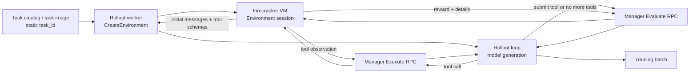
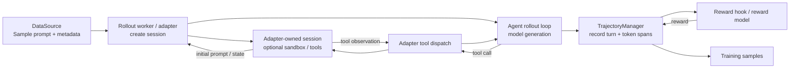
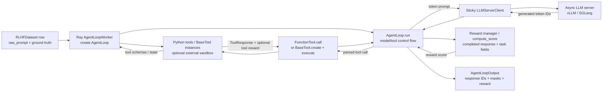

# Environment, Rollout, Tool, and Grading Contracts

This document compares the current grl contract with slime, TRL, prime-rl, and
verl. The focus is deliberately operational:

- Where is the rollout loop executed?
- Where does the environment or task state live?
- How does a model tool call reach that state?
- Where and when is grading performed?

The diagrams use the same conceptual stages in each system. `Task` means the
prompt plus any hidden reference data, `Agent/Rollout` means the component that
advances the model trajectory, and `Grader` means the component that produces
the training reward.

There are five systems shown: grl plus the four reference implementations
slime, TRL, prime-rl, and verl.

## Common vocabulary

| Concept | Meaning |
| --- | --- |
| Task source | Dataset, catalog, generator, or caller that creates a task instance |
| Environment state | Mutable state consulted or changed during a rollout |
| Rollout loop | Code that repeatedly obtains model output and decides whether to continue |
| Tool execution | Parsing a model tool call, applying it to an environment/tool, and producing an observation |
| Grading | Conversion of the final response, trajectory, or environment state into reward |

The important distinction is whether `Task source`, `Environment state`,
`Rollout loop`, and `Grader` are one component or independent components.

## grl

### Contract

grl has a manager-mediated Firecracker environment lifecycle:

```text
CreateEnvironment(task_id)
  → Initialize(task_payload_json)
  → Execute(env_id, tool_name, arguments_json)*
  → Evaluate(env_id, final_message_json, termination_reason)
  → Teardown(env_id)
```

`ListTasks` exposes only task IDs and splits. `CreateEnvironment` synchronously
boots a VM, sends the catalog's opaque payload through guest initialization, and
returns guest-generated initial chat messages and tool schemas. The rollout
worker owns model generation and the agent loop. The environment VM owns task
preparation, persistent tool state, submission semantics, and grading.

`EvaluateRequest` includes the final assistant response and termination reason,
so a plain single-turn completion is visible to the VM without a submission
tool.

### Flow



### Placement and grading

| Concern | grl location |
| --- | --- |
| Rollout loop | Training/Ray rollout worker |
| LLM generation | Same rollout worker's async inference engine |
| Environment state | Firecracker VM, reached through manager and guest protocol |
| Tool dispatch | Rollout worker → manager gRPC → VM guest |
| Grading | Environment VM, through `Evaluate` |
| Task instance | Currently selected by `task_id` and task artifact |

### Single-turn example

```text
CreateEnvironment(task_id="reverse-000001")
  → Initialize({"input":"abc","target":"cba"})
  → VM returns a neutral transformation prompt and no tools
  → model returns a three-character response
  → Evaluate(final_message_json=response)
  → VM returns positional reward 0, 1, 2, or 3
```

A plain completion such as `cba` is passed to `Evaluate` and can receive full
credit without a tool call.

### Multi-turn example

```text
VM prompt
  → model calls bash
  → Execute(bash, ...) → persistent shell observation
  → model calls bash again
  → Execute(bash, ...) → observation
  → model calls submit
  → Evaluate VM state
```

Relevant files:

- [`environment.proto`](environments/proto/grl/environment/v1/environment.proto)
- [`MANAGED_ENVIRONMENT_CONTRACT.md`](environments/MANAGED_ENVIRONMENT_CONTRACT.md)
- [`rollouts.py`](training/src/training/rollouts.py)
- [`environments.py`](training/src/training/environments.py)

## slime

### Contract

slime separates prompt/task sampling from agent execution. A data source emits
`Sample` objects, usually grouped into `n_samples_per_prompt` siblings. An
adapter runs the model interaction and records each turn in a
`TrajectoryManager`.

The environment is not a single mandatory remote abstraction. It may be:

- a local Python tool,
- a sandbox client,
- an adapter-owned session,
- or a custom agent harness.

The trajectory manager preserves generated token spans, tool observations,
message history, branching, and loss masks. Reward is usually attached after
the trajectory is complete by a reward model or custom reward hook.

### Flow



### Placement and grading

| Concern | slime location |
| --- | --- |
| Rollout loop | slime agent adapter / rollout worker |
| LLM generation | SGLang or configured inference backend |
| Environment state | Adapter, local tool, sandbox, or harness; no single required location |
| Tool dispatch | Adapter parses model output and invokes the configured tool/session |
| Grading | Post-rollout reward model or custom reward function |
| Task instance | DataSource sample and metadata; can be generated dynamically |

### Single-turn example

```text
DataSource generates text="abc", prompt="Reverse abc", answer="cba"
  → model generates "cba"
  → TrajectoryManager records one TurnRecord
  → reward hook compares completion with answer
```

### Multi-turn example

```text
DataSource emits initial prompt
  → adapter calls model
  → model emits tool call
  → adapter invokes sandbox/tool
  → tool observation is appended to the next prompt
  → adapter calls model again
  → TrajectoryManager records every generated turn and observation
  → final reward hook grades the completed sample
```

The trajectory manager is the strongest part of slime's contract: it makes
tool observations part of the training sequence while keeping model-generated
tokens distinguishable from environment tokens.

Relevant files:

- [`data_source.py`](context/slime/slime/rollout/data_source.py)
- [`trajectory.py`](context/slime/slime/agent/trajectory.py)
- [`common.py`](context/slime/slime/agent/adapters/common.py)

## TRL

### Contract

TRL is dataset- and trainer-centric. A dataset row supplies `prompt` and can
carry arbitrary extra columns such as `answer`. The trainer generates a
completion and invokes one or more reward functions with the prompt,
completion, and extra row fields.

TRL also supports an `environment_factory`. The trainer creates one Python
environment instance per generation, resets it between generations, and makes
its methods available as model tools. This is an in-process contract rather
than a remote VM/session protocol.

### Flow

```mermaid
flowchart LR
    D[Dataset row\nprompt + answer / metadata] --> C[Trainer generation worker\ncreate environment_factory instance]
    C --> E[Python environment instance\nlocal process state]
    E -->|initial/reset state| C
    C --> L[Trainer rollout loop\nmodel generation]
    L -->|tool call| X[Python method / callable tool]
    X --> E
    E -->|tool return value| X
    X --> L
    L --> G[Reward function(s)\nprompt + completion + row fields]
    G -->|reward| T[GRPO training batch]
```

### Placement and grading

| Concern | TRL location |
| --- | --- |
| Rollout loop | TRL trainer/generation path |
| LLM generation | Trainer-local model or vLLM generation integration |
| Environment state | Python object in the trainer process |
| Tool dispatch | Trainer invokes environment methods/callables directly |
| Grading | Reward functions outside the environment object |
| Task instance | Dataset row; dynamic generation can happen before or during data preparation |

### Single-turn example

```text
Dataset row:
  prompt = "Reverse abc"
  answer = "cba"

Trainer generates "cba"
  → reward_func(completion="cba", answer="cba")
  → reward 1.0
```

### Multi-turn example

```text
environment_factory() → CounterEnv(value=0)
  → model calls increment()
  → CounterEnv changes value and returns observation
  → model calls increment() again
  → final completion is passed to reward_func
```

The environment can affect the conversation, but the final grader generally
receives the generated completion and dataset fields rather than an explicit
environment-side `Evaluate` request.

Relevant files:

- [`grpo_trainer.py`](context/trl/trl/trainer/grpo_trainer.py)
- [`accuracy_rewards.py`](context/trl/trl/rewards/accuracy_rewards.py)
- [`format_rewards.py`](context/trl/trl/rewards/format_rewards.py)

## prime-rl / verifiers

### Contract

prime-rl delegates the complete rollout to an environment server. The
orchestrator knows an environment name and `task_idx`; it does not execute the
environment or interpret task-specific fields.

The environment server loads a taskset, creates task state, runs the model
interaction, and returns a typed `Trace`. In the native v1 path, the task
contains a prompt, answer, metadata, and index. `SingleTurnEnv` runs exactly
one model completion. `MultiTurnEnv` asks the environment for the next prompt
between model turns.

### Flow

```mermaid
flowchart LR
    D[Taskset / dataset builder\ntask_idx → task instance] --> C[Prime orchestrator\nrun_rollout(task_idx)]
    C --> E[Environment server worker\ntask state + rubric]
    E -->|prompt messages| C
    C --> L[Environment server rollout loop\nmodel client calls]
    L -->|tool call / model turn| X[Environment env_response\nor tool subsystem]
    X --> E
    E -->|next observation / prompt| X
    X --> L
    L --> G[Environment rubric\nfinal Trace + task answer]
    G -->|reward + Trace| C
    C --> T[Training samples]
```

### Placement and grading

| Concern | prime-rl location |
| --- | --- |
| Rollout loop | Environment server worker |
| LLM generation | Client called by the environment server |
| Environment state | Environment server worker / environment object |
| Tool dispatch | Environment's `env_response`, tool environment, or harness |
| Grading | Environment rubric, usually during cleanup/finalization |
| Task instance | Taskset dataset builder, selected by `task_idx` |

### Single-turn example

```text
task_idx=7
  → taskset builds prompt="Reverse abc", answer="cba"
  → SingleTurnEnv sends prompt to model
  → model returns "cba"
  → rubric compares completion with answer
  → Trace contains prompt, completion, and reward
```

### Multi-turn example

```text
task_idx=7
  → environment emits initial prompt
  → model produces a response
  → MultiTurnEnv.env_response(messages, state)
  → environment appends an observation / next user message
  → model produces another response
  → stop condition or max turns reached
  → rubric grades the final state/Trace
```

prime-rl has the cleanest first-class abstraction for dynamic task instances
and environment-owned multi-turn state, but it also moves the rollout loop
into the environment server instead of keeping it in the trainer.

Relevant files:

- [`orchestrator/envs.py`](context/prime-rl/src/prime_rl/orchestrator/envs.py)
- [`orchestrator/trajectories.py`](context/prime-rl/src/prime_rl/orchestrator/trajectories.py)
- [`singleturn_env.py`](context/prime-rl/deps/verifiers/verifiers/envs/singleturn_env.py)
- [`multiturn_env.py`](context/prime-rl/deps/verifiers/verifiers/envs/multiturn_env.py)
- [`reverse_text.py`](context/prime-rl/deps/verifiers/environments/reverse_text/reverse_text.py)

## verl

### Contract

verl's agent-loop abstraction is explicitly designed for multi-turn agentic
RL. A Ray `AgentLoopWorker` creates an `AgentLoopBase` instance for each input
and runs its `run()` coroutine. The agent loop owns the control flow and calls a
sticky `LLMServerClient` for token-level generation.

The default `SingleTurnAgentLoop` performs one generation. The
`ToolAgentLoop` repeatedly:

1. renders the current messages and tool schemas;
2. calls `LLMServerClient.generate(prompt_ids, ...)`;
3. parses tool calls from the exact generated token IDs;
4. invokes tools asynchronously;
5. appends tool-response tokens with response mask `0`;
6. continues generation until termination conditions are reached.

Tools are not a separate universal environment service. They are loaded in the
rollout worker and are either:

- `FunctionTool`: a stateless Python callable; or
- `BaseTool`: a stateful tool with `create`, `execute`, `calc_reward`, and
  `release` lifecycle methods.

The tool may itself contact an external sandbox or environment, but that is a
tool-specific implementation detail. verl's core contract does not provision
or address a Firecracker-like environment.

### Flow



### Placement and grading

| Concern | verl location |
| --- | --- |
| Rollout loop | Ray `AgentLoopWorker`, inside `AgentLoopBase.run()` |
| LLM generation | Separate sticky async vLLM/SGLang server |
| Environment state | Usually inside a `BaseTool` or external service used by it |
| Tool dispatch | Agent loop parses calls and invokes Python tool objects |
| Grading | Reward manager / `compute_score`; optionally async reward loop |
| Task instance | Dataset row and its non-tensor fields |

### Single-turn example

```text
Dataset row:
  raw_prompt = "Reverse abc"
  reward_model.ground_truth = "cba"

SingleTurnAgentLoop
  → LLMServerClient.generate(...)
  → response IDs for "cba"
  → reward manager decodes response and compares with ground truth
  → reward is attached to the final response token
```

### Multi-turn example

```text
ToolAgentLoop
  → generate exact token IDs
  → parse tool call
  → BaseTool.create()
  → BaseTool.execute(instance_id, args, agent_data)
  → append ToolResponse tokens with response_mask=0
  → generate again through the same sticky LLM server
  → repeat until max turns / no tool call / response limit
  → reward manager grades the completed response
```

verl's distinctive feature is that tool observations are represented directly
inside the token-level `AgentLoopOutput`, while the LLM server remains separate
from the agent/tool process. The default grading path is not environment-owned;
it is a reward-manager pass over the completed rollout and dataset fields.

Relevant files:

- [`agent_loop.py`](context/verl/verl/experimental/agent_loop/agent_loop.py)
- [`tool_agent_loop.py`](context/verl/verl/experimental/agent_loop/tool_agent_loop.py)
- [`single_turn_agent_loop.py`](context/verl/verl/experimental/agent_loop/single_turn_agent_loop.py)
- [`base_tool.py`](context/verl/verl/tools/base_tool.py)
- [`function_tool.py`](context/verl/verl/tools/function_tool.py)
- [`naive.py`](context/verl/verl/workers/reward_manager/naive.py)
- [`reward.py`](context/verl/verl/trainer/ppo/reward.py)

## Side-by-side comparison

| System | Rollout loop | Environment state | Tool call path | Grading path |
| --- | --- | --- | --- | --- |
| grl | Rollout worker | Firecracker VM | Worker → manager gRPC → VM | VM `Evaluate` |
| slime | Adapter / rollout worker | Adapter, sandbox, or harness | Adapter dispatches tool/session | Post-rollout reward hook/model |
| TRL | Trainer generation path | In-process Python environment | Direct Python method call | Reward function over completion + row |
| prime-rl | Environment server worker | Environment object/server worker | Environment `env_response` / tool subsystem | Environment rubric over Trace/state |
| verl | Ray AgentLoopWorker | `BaseTool` or external service | Agent loop → Python tool object | Reward manager / `compute_score` |

## Most relevant contract differences for grl

### Rollout ownership

- grl and slime keep the main rollout loop in the rollout-side worker.
- TRL keeps it in the trainer/generation path.
- prime-rl moves it into the environment server.
- verl keeps it in an agent-loop worker but delegates each generation to a
  separate sticky inference server.

### Environment ownership

- grl makes the VM a first-class environment session with an explicit lifecycle.
- prime-rl makes the environment server and its task state first-class, but the
  server also owns the rollout loop.
- verl and TRL treat environments primarily as tools.
- slime intentionally leaves environment placement open.

### Tool observations and token accounting

All five systems feed tool observations back into the next model turn, but the
strength of the token-level contract differs:

- grl's worker bridges sampled model tokens with tool-message tokens.
- slime's `TrajectoryManager` records generated spans and loss masks.
- prime-rl returns a structured Trace with branches and turn data.
- verl's `response_mask` explicitly marks model tokens as `1` and tool tokens as
  `0`.
- TRL is the least prescriptive about token-exact multi-turn trajectory
  accounting.

### Grading ownership

The systems divide into two groups:

```text
Environment-owned grading:
    grl, prime-rl

Trainer/reward-pipeline-owned grading:
    slime, TRL, verl
```

For grl, environment-owned grading is appropriate for SWE-bench-like tasks and
VM-backed state. The protocol now carries the final assistant response in
`EvaluateRequest`, so simple single-turn tasks do not require an artificial
`submit` tool.

### Dynamic task generation

The simplest dynamic-task patterns in the references are:

- TRL/slime/verl: generate or attach the task instance in the dataset/sample
  row before rollout.
- prime-rl: taskset/dataset builder creates the task instance from `task_idx`.
- grl: the catalog provides an opaque `task_payload_json`; the guest validates
  and interprets it during initialization.

For grl, a flexible contract should therefore make an opaque task instance (or
deterministic task seed) an input to `CreateEnvironment`, return the resolved
task identity and initial messages, and pass the final assistant message to
`Evaluate`.
